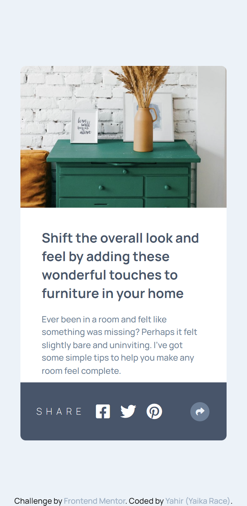

# Frontend Mentor - Article preview component solution

This is a solution to the [Article preview component challenge on Frontend Mentor](https://www.frontendmentor.io/challenges/article-preview-component-dYBN_pYFT). Frontend Mentor challenges help you improve your coding skills by building realistic projects. 

## Table of contents

- [Overview](#overview)
  - [The challenge](#the-challenge)
  - [Screenshots](#screenshots)
  - [Links](#links)
- [My process](#my-process)
  - [Built with](#built-with)
  - [What I learned](#what-i-learned)
  - [Continued development](#continued-development)
- [Author](#author)

## Overview

### The challenge

Users should be able to:

- View the optimal layout for the component depending on their device's screen size
- See the social media share links when they click the share icon

### Screenshots
#### Desktop normal view

#### Desktop active view

#### Mobile normal view

#### Mobile active view

### Links

- Live Site URL: [Click here](https://article-preview-component-yaikarace.vercel.app)

## My process

### Built with

- Semantic HTML5 markup
- CSS custom properties
- Flexbox
- CSS Grid
- Mobile-first workflow
- [Tailwind CSS](https://tailwindcss.com/) - CSS Framework

### What I learned
I learned how to make a text bubble shape, and I also learned how to make CSS property transitions with Tailwind CSS.

### Continued development
I will continue to learn how to use Tailwind and more CSS properties.

## Author

- Frontend Mentor - [@YaikaRace](https://www.frontendmentor.io/profile/yaikarace)
- GitHub - [YaikaRace](https://github.com/yaikarace)
- YouTube Channel - [Yaika Race](https://youtube.com/c/yaikarace)